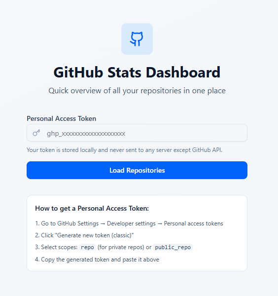
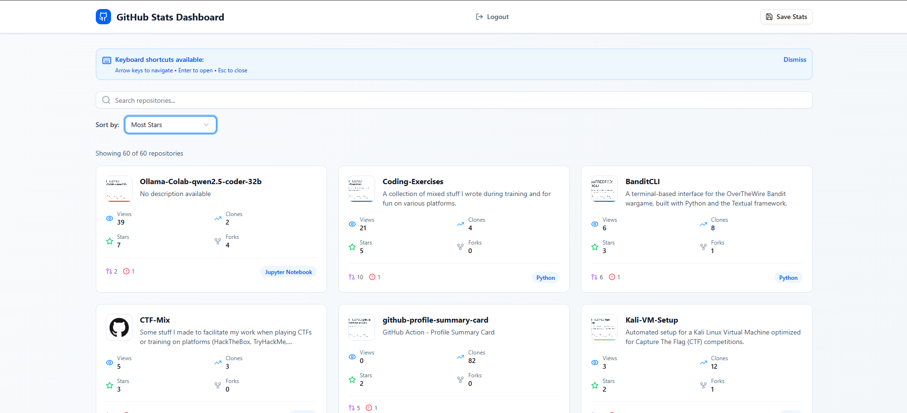
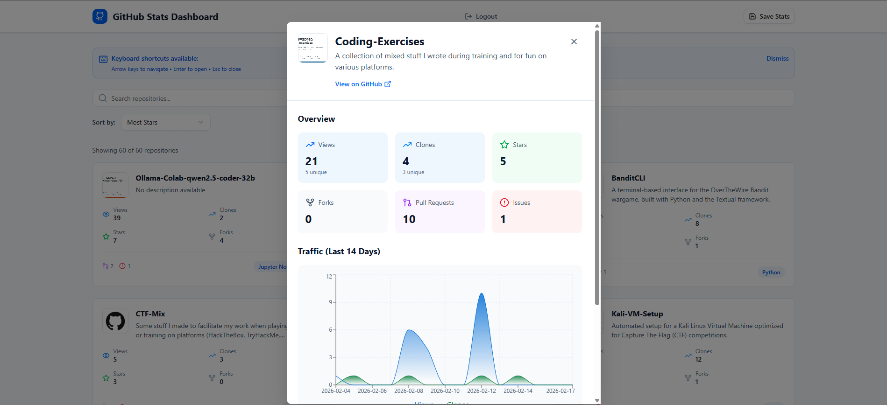
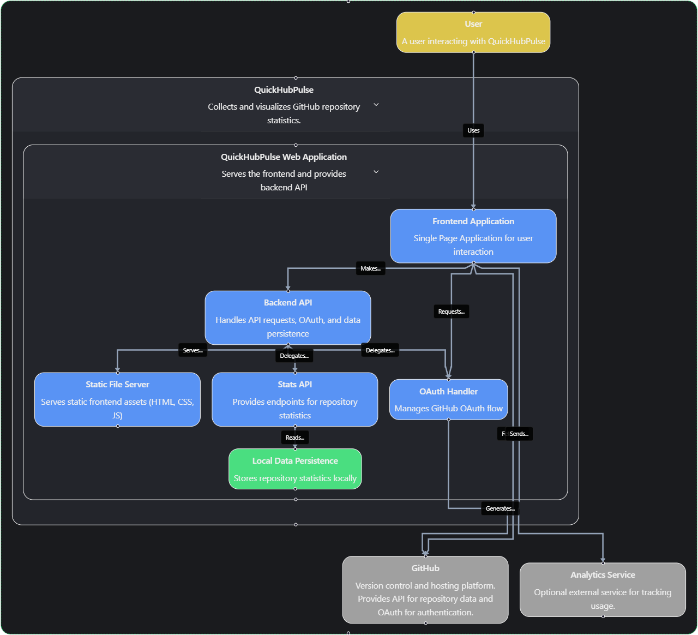

# QuickHubPulse - GitHub Stats Dashboard


[](https://app.netlify.com/projects/quickhubpulse/deploys)

A streamlined, modern dashboard for quick repository overview with detailed insights. Built with React 19, Tailwind CSS, and Vite.

## Live Demo

[https://quickhubpulse.netlify.app/](https://quickhubpulse.netlify.app/)

## Screenshots

### Token Authentication
Enter your GitHub Personal Access Token to get started:



### Repository Dashboard
View all your repositories in a responsive grid layout with key metrics:



### Detailed Statistics
Click any repository card to see comprehensive statistics and traffic trends:



## Features

### Repository Overview

- **Responsive Grid Layout**: Adapts from 1 column (mobile) to 3 columns (desktop)
- **Quick Metrics**: Each card displays views, clones, stars, forks, PRs, and issues at a glance
- **Repository Images**: OpenGraph images from GitHub with fallback to GitHub icon
- **Language Badges**: Color-coded programming language indicators

### Search & Filter

- **Real-time Search**: Filter repositories by name or description instantly
- **Result Counter**: Shows how many repositories match your search

### Detailed Modal View

Click any repository card to open a detailed modal with:

- **Comprehensive Metrics**: Views (unique/total), clones, stars, forks, pull requests, issues
- **Traffic Chart**: 14-day trend visualization showing views and clones
- **Repository Info**: Language, creation date, last update, owner
- **GitHub Link**: Direct link to view the repository on GitHub

### Smooth Animations

- Staggered card entrance animations
- Hover effects with subtle lift
- Smooth modal transitions using Framer Motion
- Loading skeleton states

---



---

## Getting Started

### Prerequisites

- Node.js 18+
- pnpm (recommended) or npm
- GitHub Personal Access Token

### Creating a GitHub Personal Access Token

1. Go to [GitHub Settings → Developer settings → Personal access tokens → Tokens (classic)](https://github.com/settings/tokens)
2. Click "Generate new token (classic)"
3. Give your token a descriptive name (e.g., "Stats Dashboard")
4. Select scopes:
   - `repo` - Full control of private repositories (required for traffic data)
   - OR `public_repo` - Access to public repositories only
5. Copy the generated token (you won't be able to see it again!)

### Installation

```bash
# Clone the repository
git clone https://github.com/TheRealFREDP3D/QuickHubPulse
cd QuickHubPulse

# Install dependencies
pnpm install

# Start development server
pnpm run dev
```

The application will be available at `http://localhost:3000` (or another port if 3000 is in use).

### Usage

1. Open the dashboard in your browser
2. Paste your GitHub Personal Access Token in the input field
3. Click "Load Repositories"
4. Browse your repositories in the grid
5. Click any card to view detailed statistics and traffic trends
6. Use the search bar to filter repositories by name or description

## Project Structure

```
client/
  public/           ← Static assets
  src/
    components/     ← Reusable UI components
    pages/          ← Page components (TokenInput, Dashboard)
    hooks/          ← Custom React hooks (useGitHubAPI)
    contexts/       ← React contexts (ThemeContext)
    lib/            ← Utility functions
    utils/          ← Utility functions (OAuth, error handling)
    App.tsx         ← Main app component
    main.tsx        ← React entry point
    index.css       ← Global styles and theme
server/
  index.ts         ← Express.js backend for stats persistence and OAuth
data/              ← Local storage for statistics (created automatically)
```

## Key Components

### TokenInput

Handles GitHub token authentication with instructions for obtaining a personal access token.

### Dashboard

Main page displaying the repository grid, search functionality, and modal detail view.

### RepositoryCard

Individual repository card showing key metrics and repository information.

### RepositoryDetail

Modal component displaying comprehensive repository statistics and traffic charts.

### useGitHubAPI Hook

Custom hook managing GitHub API calls, data fetching, and state management.

## Technology Stack

### Frontend
- **React 19**: UI framework
- **Tailwind CSS 4**: Styling
- **Vite**: Build tool and dev server
- **Framer Motion**: Animations
- **Recharts**: Charts and data visualization
- **Lucide React**: Icons
- **shadcn/ui**: UI components
- **date-fns**: Date formatting

### Backend
- **Express.js**: Minimal server for local stats persistence and OAuth
- **Node.js**: Runtime environment

## API Integration

The dashboard uses the GitHub REST API to fetch:

- User repositories (`GET /user/repos`)
- Repository details (`GET /repos/{owner}/{repo}`)
- Traffic views (`GET /repos/{owner}/{repo}/traffic/views`)
- Traffic clones (`GET /repos/{owner}/{repo}/traffic/clones`)
- Pull requests (`GET /repos/{owner}/{repo}/pulls`)
- Issues (`GET /repos/{owner}/{repo}/issues`)

All API calls are made directly from the browser to GitHub. Your token is stored locally and never sent to any server except GitHub.

## Authentication Methods

The dashboard supports three authentication methods:

### 1. Personal Access Token (Recommended)
- Enter your GitHub Personal Access Token directly
- Full access to private repositories and traffic data
- Token is stored locally in browser storage only

### 2. Username Only
- Enter any GitHub username to view public repositories
- No authentication required
- Limited to public repository information only
- Traffic data and private stats are not available

### 3. GitHub OAuth (Development Setup Required)
- Click "Login with GitHub" to authenticate via OAuth
- Requires backend configuration with GitHub OAuth App
- Currently in development - requires environment variables:
  - `GITHUB_CLIENT_ID`: Your GitHub OAuth App client ID
  - `GITHUB_REDIRECT_URI`: OAuth callback URL (default: `http://localhost:3000/auth/github/callback`)

To set up OAuth:
1. Create a GitHub OAuth App at [GitHub Settings → Developer settings → OAuth Apps](https://github.com/settings/applications/new)
2. Set the callback URL to `http://localhost:3000/auth/github/callback`
3. Copy the Client ID to your environment variables
4. The OAuth flow will redirect back to the app after authentication

## Local Backend for Stats Persistence

The application includes a lightweight Express.js backend for local statistics persistence:

### Features
- Save repository statistics locally with timestamps
- Retrieve historical statistics
- Get the most recent saved statistics
- File-based storage using JSON

### API Endpoints
- `POST /api/stats` - Save new repository statistics
- `GET /api/stats` - Get all historical statistics
- `GET /api/stats/latest` - Get the most recent statistics

### Usage
The backend is automatically started when running `pnpm run dev`. Statistics can be saved manually using the "Save Stats" button in the dashboard, which stores the current repository data locally for future reference.

### Data Storage
Statistics are stored in `data/repository-stats.json` in the project root. Each entry includes:
- Timestamp when the statistics were saved
- Complete repository data including metrics and traffic information

## Design Philosophy

The dashboard follows a **Modern Minimalist** design approach:

- **Information Hierarchy**: Most important metrics are immediately visible
- **Rapid Scanning**: Grid layout enables quick visual comparison
- **Progressive Disclosure**: Details appear in modal, keeping main view uncluttered
- **Developer-First**: Uses familiar GitHub colors and patterns

### Color Scheme

- **Primary**: GitHub Blue (#0969da)
- **Accent**: Green (#1a7f37) for positive metrics
- **Neutral**: Slate grays for secondary information

## Performance Considerations

- Lazy loading of repository images
- Efficient state management with React hooks
- Memoized filtering for search functionality
- Optimized animations using Framer Motion

## Browser Support

- Chrome/Edge 90+
- Firefox 88+
- Safari 14+

## License

MIT

## Contributing

Contributions are welcome! Please feel free to submit a Pull Request.

## Troubleshooting

### "GitHub API error: 401 Unauthorized"

Your token is invalid or expired. Generate a new token and try again.

### "GitHub API error: 403 Forbidden"

Your token doesn't have the required scopes. Regenerate with `repo` or `public_repo` scope.

### Traffic data not showing

Traffic data is only available for repositories where you have push access. Public repositories you don't own won't show traffic data.

### Images not loading

Repository social images may not be available for all repos. The dashboard will fall back to the GitHub icon.

## Support

For issues or questions, please open an issue on the GitHub repository.
